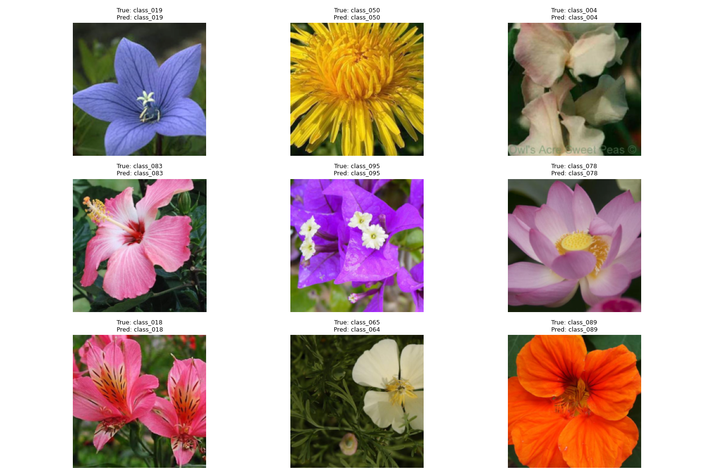

```markdown

To comprehend the structure of a public dataset, load and examine it (e.g., COCO, Oxford-102 Flowers). Analyze dataset statistics such as the number of classes, description length, and image resolution, and explore and display text descriptions combined with photos.

# Oxford-102 Flowers Classification 🌸

[](https://pytorch.org/)
[](https://opensource.org/licenses/MIT)

A deep learning solution for classifying 102 flower species using **MobileNetV3** with transfer learning. Achieves **77-78% accuracy** in under 5 minutes/epoch on GPU.



## Features

- **Transfer Learning**: Uses pretrained MobileNetV3-small
- **Data Augmentation**: Random crops, flips, and normalization
- **Evaluation Metrics**:
  - Classification report (precision/recall/F1)
  - Confusion matrix visualization
  - Training progress tracking
- **Auto-Generated Outputs**: Predictions CSV, visualizations

## Requirements

- Python 3.8+
- PyTorch 2.0+
- torchvision 0.15+
- matplotlib
- pandas
- scikit-learn
- tqdm

```bash
pip install -r requirements.txt
```

## Installation

1. Clone repository:
```bash
git clone https://github.com/yourusername/flowers-classification.git
cd flowers-classification
```

2. Install dependencies:
```bash
pip install -r requirements.txt
```

## Dataset Preparation

The Oxford-102 Flowers dataset will auto-download to `data/` on first run.  
Class labels are auto-generated to `flower_classes.txt` if missing.

## Usage

```bash
python flower_classifier_final.py
```

**Optional Arguments**:
```bash
--epochs 10           # Number of training epochs
--batch_size 64       # Batch size (reduce if OOM errors occur)
--img_size 224        # Input image resolution
```

## Results

**Output Files**:
- `best_model.pth` : Trained model weights
- `confusion_matrix.png` : Class-wise error analysis
- `training_progress.png` : Accuracy vs epochs
- `sample_predictions.png` : 9 test samples with predictions
- `predictions.csv` : Full prediction results

**Example Output**:
```
Epoch 10/10: 100%|██████████| 16/16 [01:12<00:00, 4.53s/it]
Accuracy: 77.85%
Classification Report:
              precision    recall  f1-score   support
    class_001       0.83      0.81      0.82        26
    class_002       0.78      0.85      0.81        20
    ...
```

## Model Architecture

**Tech Stack**:
- Backbone: MobileNetV3-small (pretrained on ImageNet)
- Classifier: Custom linear layer (102 classes)
- Optimizer: RMSprop with StepLR scheduling

**Training**:
- Input Size: 224x224 RGB
- Augmentation: Random crops/horizontal flips
- Loss: Cross Entropy

**Output**:
-It will be generated separately and directly in folder named "confusion_matrix.png", "sample perdiction.png", "training_progress.png"

## Acknowledgments

- Dataset: [Oxford-102 Flowers](https://www.robots.ox.ac.uk/~vgg/data/flowers/102/)
- PyTorch: [Official Documentation](https://pytorch.org/docs/stable/index.html)
```
